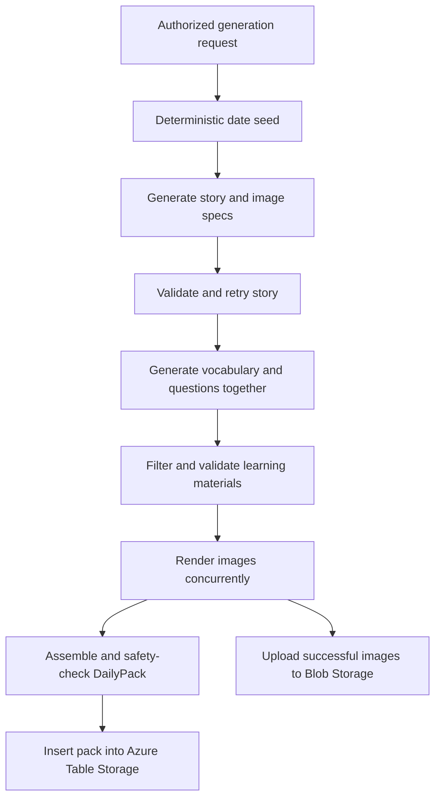

# Inkydoop

Inkydoop is an AI-powered English Language Arts reading app. It generates illustrated stories for three reading tiers, then builds vocabulary practice and comprehension questions from each finished story.

The application is anonymous and story-first. Readers can open the latest story for their reading tier, browse previously generated packs, practice vocabulary, review comprehension questions, and print a teacher worksheet with an answer key.

## Current Status

The implemented application includes:

- Tier-aware story generation with corrective validation retries.
- One combined AI call for vocabulary and comprehension materials.
- Up to three non-blocking story illustrations.
- An archive of append-only story packs.
- Inline word definitions with story vocabulary and dictionary lookup fallback.
- A scored, client-side multiple-choice vocabulary exercise.
- Manual comprehension self-review with answer and explanation reveal.
- A printable teacher pack with an answer key.
- A key-protected admin generation page and API.
- A story-first landing page with recent stories, genre discovery, sharing, direct learning actions, and a teacher entry point.
- Immersive full-width story covers and inline scene illustrations that preserve their complete composition, with a constrained reading column.
- Light and dark themes.
- Azure Table and Blob Storage support, with Azurite for local development.
- A server-side grading API that is implemented but not used by the current quiz UI.

## Technology

- Next.js 16 App Router
- React 19
- TypeScript
- Tailwind CSS 4
- Zod 4
- OpenRouter for text and image model requests
- Azure Table Storage for story packs
- Azure Blob Storage for story images
- Azure Identity for production storage authentication
- Azurite for local storage emulation
- Vitest for unit tests
- Playwright configured for browser tests

The project uses Node.js 22 or newer and pnpm.

## Reader Experience

### Home

The home page resolves the most recently generated pack for the saved reading tier and presents it as the featured story. It displays:

- Cover art, a spoiler-free hook, tier, genre, theme, and reading time.
- Exact links to read the story, practice its vocabulary, and review its questions.
- Print and native share actions for the featured pack.
- A tier-filtered shelf of recently added stories.
- Genre shortcuts that open filtered Story Library views.
- A teacher-focused entry point for printable packs.
- The reading-level selector, Story Library link, and persisted theme toggle.

If no matching tier exists, the app tries the latest pack from any tier. If storage is unavailable or contains no packs, it displays the bundled sample pack.

The page labels a pack as "Today's story" only when it is a stored pack dated today; sample and older packs are labeled "Featured story."

### Story

The story page displays:

- An immersive cover with the title, hook, genre, theme, and estimated reading time. The complete illustration is contained over a soft full-frame backdrop rather than cropped.
- Story paragraphs constrained to a comfortable reading width.
- Large scene illustrations that preserve the full image while expanding to the story canvas and remaining inline with their configured paragraphs.
- Tap-a-word definitions.
- Links to the vocabulary activity and printable teacher pack.

Generated vocabulary words are highlighted and use definitions stored in the pack. Other clicked words are looked up through `dictionaryapi.dev`.

### Vocabulary

The vocabulary page lists each selected word with:

- Part of speech.
- Kid-friendly definition.
- A verbatim example from the story.
- Synonyms and antonyms when available.

It also creates a local multiple-choice definition exercise. Answers are scored in the browser and can be replayed without an API request.

### Comprehension

The comprehension page supports multiple-choice and free-text responses. Readers can reveal the stored answer and explanation for manual comparison.

The current UI does not automatically grade, score, or submit comprehension answers.

### Story Library

The Story Library loads pack metadata without loading complete story JSON. It displays stories newest-first with:

- Cover image or fallback art.
- Reading tier.
- Genre and theme.
- Reading time and generation date.
- A link to the exact pack by immutable ID.

The first 12 results are server-rendered. Additional pages load through a continuation cursor. The optional `genre` query parameter filters both the initial result and subsequent pages.

### Teacher Pack

`/print/[id]` renders a print-oriented worksheet containing:

- Story text.
- Vocabulary definitions and examples.
- Comprehension questions.
- A separate answer-key section.

The Print button opens the browser print dialog, which can print the worksheet or save it as a PDF.

### Admin Generation

`/admin` provides a form for an authorized operator to choose a date and reading tier, enter the generation key, and create a new pack.

Every successful run creates a new pack. Existing packs are not overwritten.

## Reading Tiers

Tier configuration lives in `src/lib/gen/tiers.ts`.

| ID        | Label   | Grade guidance | Lexile guidance | Target words | Accepted words | FK grade range |
| --------- | ------- | -------------- | --------------- | -----------: | -------------: | -------------: |
| `early`   | Early   | K-2            | 200-500         |          450 |        300-650 |        0.5-2.9 |
| `growing` | Growing | 3-6            | 500-850         |        1,000 |      700-1,300 |        2.0-6.5 |
| `middle`  | Middle  | 6-8            | 800-1050        |        1,200 |    1,000-1,500 |        6.0-9.0 |

`growing` is the default. The selected tier is stored in a one-year `tier` cookie so server-rendered pages can resolve the appropriate pack.

## Application Routes

| Route                      | Behavior                                                                                                                         |
| -------------------------- | -------------------------------------------------------------------------------------------------------------------------------- |
| `/`                        | Featured story, recent shelf, learning actions, genre discovery, teacher actions, tier selector, library link, and theme toggle. |
| `/story?id=<pack-id>`      | Exact story pack when `id` is present; otherwise the latest resolved pack.                                                       |
| `/vocabulary?id=<pack-id>` | Vocabulary list and local multiple-choice activity for the resolved pack.                                                        |
| `/quiz?id=<pack-id>`       | Manual comprehension response and answer-reveal UI.                                                                              |
| `/library?genre=<genre>`   | Newest-first, metadata-only archive with optional genre filtering and cursor pagination.                                         |
| `/print/[id]`              | Print-oriented story, vocabulary, questions, and answer key.                                                                     |
| `/admin`                   | Manual, key-protected pack generation UI.                                                                                        |

All reader pages are dynamically rendered because they resolve current storage and cookie state.

## API Routes

### `POST /api/generate`

`GET` is also mapped to the same handler for manual operation.

Authentication:

- `x-generate-key` request header, preferred.
- `key` query parameter, also accepted.
- Compared with `GENERATE_API_KEY` using a constant-time comparison.

Query parameters:

| Name   | Required | Description                                                  |
| ------ | -------- | ------------------------------------------------------------ |
| `date` | No       | Pack date in `YYYY-MM-DD`; defaults to the current UTC date. |
| `tier` | No       | `early`, `growing`, or `middle`; defaults to `growing`.      |

The endpoint is limited to five requests per minute per client IP within each running process.

Successful response:

```json
{
  "ok": true,
  "id": "<pack-id>",
  "date": "2026-09-01",
  "tier": "growing",
  "generated": true,
  "durationMs": 12345
}
```

### `GET /api/stories`

Returns metadata-only archive pages.

Query parameters:

| Name     | Required | Description                                                   |
| -------- | -------- | ------------------------------------------------------------- |
| `limit`  | No       | Page size; defaults to 12 and is capped at 50.                |
| `cursor` | No       | Azure Table continuation token returned by the previous page. |
| `tier`   | No       | Optional exact tier filter.                                   |
| `genre`  | No       | Optional lowercase genre filter, such as `mystery`.           |

The endpoint is limited to 60 requests per minute per client IP within each running process. If storage is unavailable, it returns an empty `items` array.

```json
{
  "items": [],
  "nextCursor": "<optional-continuation-token>"
}
```

### `GET /api/image`

Streams an image from Blob Storage.

- Requires a validated `path` query parameter ending in `.webp`, `.png`, or `.jpeg`.
- Rejects traversal paths.
- Returns one-day public immutable caching headers.
- Returns `404` when the blob does not exist.

### `GET /api/dev/story`

Generates a story draft for inspection without assembling or storing a complete pack.

- Accepts optional `date` and `tier` query parameters.
- Available only outside production.
- Returns `404` when `NODE_ENV=production`.

### `POST /api/grade`

Grades one comprehension answer through the implemented grading pipeline. The current reader UI does not call this endpoint.

Request body:

```json
{
  "id": "<optional-pack-id>",
  "questionId": "q1",
  "answer": "A reader response"
}
```

- `answer` is limited to 1,000 characters.
- Requests are limited to 20 per minute per client IP within each running process.
- The pack is resolved by ID or through the normal latest/sample fallback.

Response:

```json
{
  "grade": "nailed_it",
  "feedback": "Great job!",
  "graderAgreement": true,
  "judged": false
}
```

## Content Generation

Generation runs only through `/api/generate` or the admin page. Reader requests never generate or mutate packs.



### 1. Date Seed

`seedForDate()` hashes the requested date and deterministically selects from broad, age-appropriate pools spanning mystery, fantasy, science, travel, family, school, arts, nature, character growth, relationships, and community. Repeating a date keeps its genre and theme stable for the current pool definitions, while the model can still create a different story.

### 2. Story Draft

`generateStory()` calls `OPENROUTER_MODEL_STORY` with the selected genre, theme, tier limits, writing guidance, and illustration requirements.

The expected output contains:

- Title, spoiler-free preview hook, genre, and theme.
- Story paragraphs.
- Candidate vocabulary.
- Art direction and character descriptions.
- One cover and scene image specifications.

Story validation checks:

- Tier word-count bounds.
- Tier Flesch-Kincaid grade range.
- Banned safety terms.
- Exactly one cover image specification.
- At least one scene image specification.

The story receives up to three attempts: one initial generation and two corrective retries. If the story omits image specifications, `OPENROUTER_MODEL_LEARNING` regenerates only those specifications without rewriting the story.

### 3. Learning Materials

After the story passes validation, `generateLearningMaterials()` sends the finalized story once to `OPENROUTER_MODEL_LEARNING`. The call returns vocabulary and comprehension questions together.

Vocabulary filtering:

- Removes duplicate words case-insensitively.
- Requires each example to occur in the story.
- Limits definitions to 140 characters.
- Keeps at most 10 words.

Question filtering:

- Removes duplicate IDs.
- Requires at least one `mustInclude` rubric item.
- Requires a multiple-choice answer to appear in its choices.

### 4. Illustrations

`renderImages()` requests all image specifications concurrently through OpenRouter's dedicated Image API using `IMAGE_MODEL` and `IMAGE_API_KEY`.

- Requests specify a 16:9 landscape aspect ratio and prefer WebP output.
- The prompt combines shared art direction, setting, character descriptions, scene instructions, landscape composition guidance, and kid-safe constraints.
- Returned PNG, JPEG, and WebP bytes are detected from their file signatures rather than trusting response metadata.
- Successful bytes are uploaded to `<pack-id>/cover.<ext>` or `<pack-id>/scene-N.<ext>`.
- Individual image failures are logged and dropped; they do not prevent the text pack from being stored.

### 5. Assembly and Persistence

The pack is assembled with a reading-time estimate of 150 words per minute. A final banned-term pass checks the title, story text, and question text. If it passes, the new pack is inserted into Azure Table Storage.

## Grading Pipeline

The grading backend in `src/lib/grade` remains available for future use or direct API clients:

1. Route multiple-choice and short literal answers through local exact/fuzzy matching.
2. Screen open-ended text with `OPENROUTER_MODEL_GUARD`.
3. Run two graders using `OPENROUTER_MODEL_GRADER`.
4. Use `OPENROUTER_MODEL_JUDGE` when graders disagree or confidence is low.
5. Generate kind feedback with `OPENROUTER_MODEL_FEEDBACK`.

Grades are `nailed_it`, `almost`, or `lets_look_again`.

The current comprehension UI intentionally performs manual self-review and does not invoke this pipeline.

## Data Model

Zod schemas in `src/lib/schemas.ts` are the runtime and TypeScript source of truth.

```ts
interface DailyPack {
  date: string;
  tier: "early" | "growing" | "middle";
  story: {
    title: string;
    hook: string;
    genre: string;
    theme: string;
    paragraphs: string[];
    readingTimeMin: number;
    targetWords: string[];
    artDirection: {
      style: string;
      characters: { name: string; look: string }[];
      setting: string;
    };
    images: {
      role: "cover" | "scene";
      afterParagraph: number;
      alt: string;
      blobPath: string;
    }[];
  };
  vocabulary: {
    word: string;
    pos: string;
    definition: string;
    exampleFromStory: string;
    synonyms: string[];
    antonyms: string[];
  }[];
  questions: {
    id: string;
    type:
      "literal" | "inferential" | "vocabulary-in-context" | "theme" | "extra";
    question: string;
    answer: string;
    explanation: string;
    choices?: string[];
    rubric: {
      mustInclude: string[];
      niceToHave: string[];
      commonWrongPatterns: string[];
    };
  }[];
}
```

## Storage

### Azure Table Storage

All packs use `PartitionKey = "daily"`.

Each generation creates a unique sortable `RowKey` containing:

- Inverted date.
- Inverted generation timestamp.
- A short random suffix.

Ascending queries therefore return newer dates first and newer generations first within a date. Multiple packs can coexist for the same date and tier.

Each entity stores:

- Full validated pack JSON in `packJson`.
- Date, tier, and creation timestamp.
- Denormalized title, genre, theme, reading time, and cover path for archive queries.

Exact story links use a point read by partition and row key. Archive queries project metadata only and use Azure continuation tokens.

Archive queries can filter the denormalized `genre` column without loading `packJson`.

### Azure Blob Storage

Story images are stored in the configured container under paths namespaced by pack ID. The application serves them through `/api/image` rather than exposing storage credentials to the browser.

### Authentication

- Local development uses `AZURE_STORAGE_CONNECTION_STRING` with Azurite.
- Production code uses `AZURE_STORAGE_ACCOUNT` with `DefaultAzureCredential`.

The repository does not currently contain production infrastructure or RBAC deployment definitions.

## Fallback Behavior

`getServedPack()` resolves content in this order:

1. Exact pack ID, when supplied and found.
2. Latest pack for the selected tier.
3. Latest pack from any tier.
4. Bundled sample pack.

Storage errors also fall through to the sample pack. The Story Library instead renders an empty result when storage is unavailable.

## Environment Configuration

Copy `.env.example` to `.env.local`. Environment files are ignored by Git.

Required secrets:

| Variable             | Purpose                                          |
| -------------------- | ------------------------------------------------ |
| `OPENROUTER_API_KEY` | Text generation requests.                        |
| `IMAGE_API_KEY`      | Image generation requests through OpenRouter.    |
| `GENERATE_API_KEY`   | Protects `/api/generate`; minimum 32 characters. |

Model settings have defaults:

| Variable                    | Default                         |
| --------------------------- | ------------------------------- |
| `OPENROUTER_MODEL_STORY`    | `openai/gpt-5.5`                |
| `OPENROUTER_MODEL_LEARNING` | `openai/gpt-4o-mini`            |
| `OPENROUTER_MODEL_GUARD`    | `openai/gpt-4o-mini`            |
| `OPENROUTER_MODEL_FEEDBACK` | `openai/gpt-4o-mini`            |
| `OPENROUTER_MODEL_GRADER`   | `openai/gpt-4o-mini`            |
| `OPENROUTER_MODEL_JUDGE`    | `openai/gpt-4o`                 |
| `IMAGE_MODEL`               | `google/gemini-2.5-flash-image` |

Storage settings:

| Variable                          | Required                  | Default        |
| --------------------------------- | ------------------------- | -------------- |
| `AZURE_STORAGE_CONNECTION_STRING` | One storage mode required | None           |
| `AZURE_STORAGE_ACCOUNT`           | One storage mode required | None           |
| `AZURE_TABLE_NAME`                | No                        | `DailyPacks`   |
| `AZURE_BLOB_CONTAINER`            | No                        | `story-images` |

At least one of `AZURE_STORAGE_CONNECTION_STRING` or `AZURE_STORAGE_ACCOUNT` must be set. Configuration is validated with Zod on first server-side environment access.

Never commit `.env.local`, API keys, or generation keys. Rotate any key that has been exposed outside its intended secret store.

## Local Development

Prerequisites:

- Node.js 22 or newer.
- pnpm 10.

Install dependencies:

```powershell
pnpm install
```

Create local configuration:

```powershell
Copy-Item .env.example .env.local
```

Fill in the required secrets, then start Azurite in one terminal:

```powershell
pnpm dev:storage
```

Start Next.js in another terminal:

```powershell
pnpm dev
```

Open `http://localhost:3000`.

Generate a pack from `http://localhost:3000/admin`, or call the API:

```powershell
$headers = @{ "x-generate-key" = "<your-generate-key>" }
Invoke-RestMethod `
  -Method Post `
  -Uri "http://localhost:3000/api/generate?date=2026-09-01&tier=growing" `
  -Headers $headers
```

## Scripts

| Command            | Purpose                                   |
| ------------------ | ----------------------------------------- |
| `pnpm dev`         | Start the Next.js development server.     |
| `pnpm dev:storage` | Start Azurite for Table and Blob Storage. |
| `pnpm lint`        | Run ESLint.                               |
| `pnpm test`        | Run Vitest once.                          |
| `pnpm test:e2e`    | Run Playwright tests.                     |
| `pnpm build`       | Create a production build.                |
| `pnpm start`       | Run the built Next.js server.             |
| `pnpm format`      | Format the repository with Prettier.      |

## Tests and CI

Unit tests cover:

- Zod pack schemas.
- Deterministic date seeds.
- Story validators and readability checks.
- Combined learning-material orchestration.
- Vocabulary and question filtering.
- Local grading routing.
- Table metadata and pagination helpers.

GitHub Actions runs the following on pull requests and pushes to `main`:

```text
pnpm install --frozen-lockfile
pnpm lint
pnpm test
pnpm build
```

Playwright is configured in `playwright.config.ts`, but the repository currently has no browser test files. `pnpm test:e2e` therefore reports that no tests were found.

## Project Structure

```text
src/
  app/                 Next.js pages and API route handlers
  components/          Interactive reader, library, quiz, and theme UI
  lib/
    ai/                 OpenRouter JSON client
    gen/                Seed, tiers, story, learning, images, validation, assembly
    grade/              Optional answer-grading pipeline
    store/              Azure Table/Blob access and read fallback
    env.ts              Server-only validated environment access
    fallback.ts         Bundled sample pack
    prompts.ts          Model instructions
    schemas.ts          Shared Zod schemas and inferred types
```

## Current Operational Limitations

- Image responses are not moderated after generation.
- WebP is requested, but providers can return PNG or JPEG; those formats are stored as received. There is no local conversion or byte-size limit.
- Content safety uses prompt constraints and a small banned-term filter, not a dedicated moderation service.
- Generation is a synchronous HTTP operation and can take several minutes.
- Rate limiting is in-memory and applies per running process, not across replicas.
- Reader fallback does not expose freshness metadata or distinguish an older pack from the current date in the UI.
- Storage failures can be hidden by the bundled sample fallback.
- The grading API is not connected to the comprehension UI.
- There are no Playwright tests yet.
- There are no Docker, Bicep, Terraform, `azd`, or deployment workflow files.
- Generation token usage, provider cost, retries, and per-step timings are not persisted.
- The application has no accounts or server-side reader progress.

These limitations describe the current repository state; they are not implemented features.
