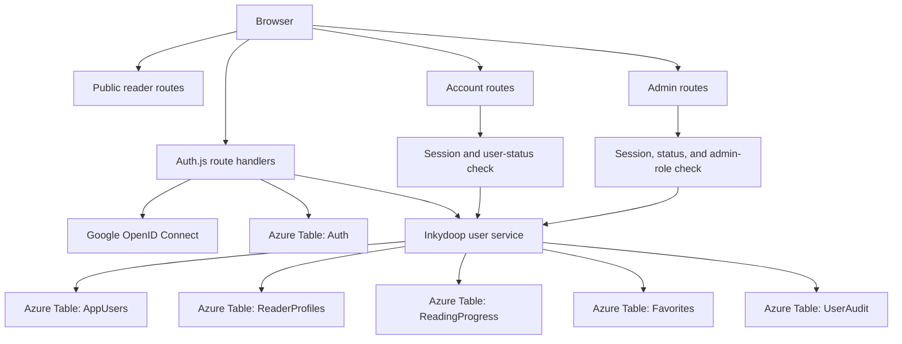
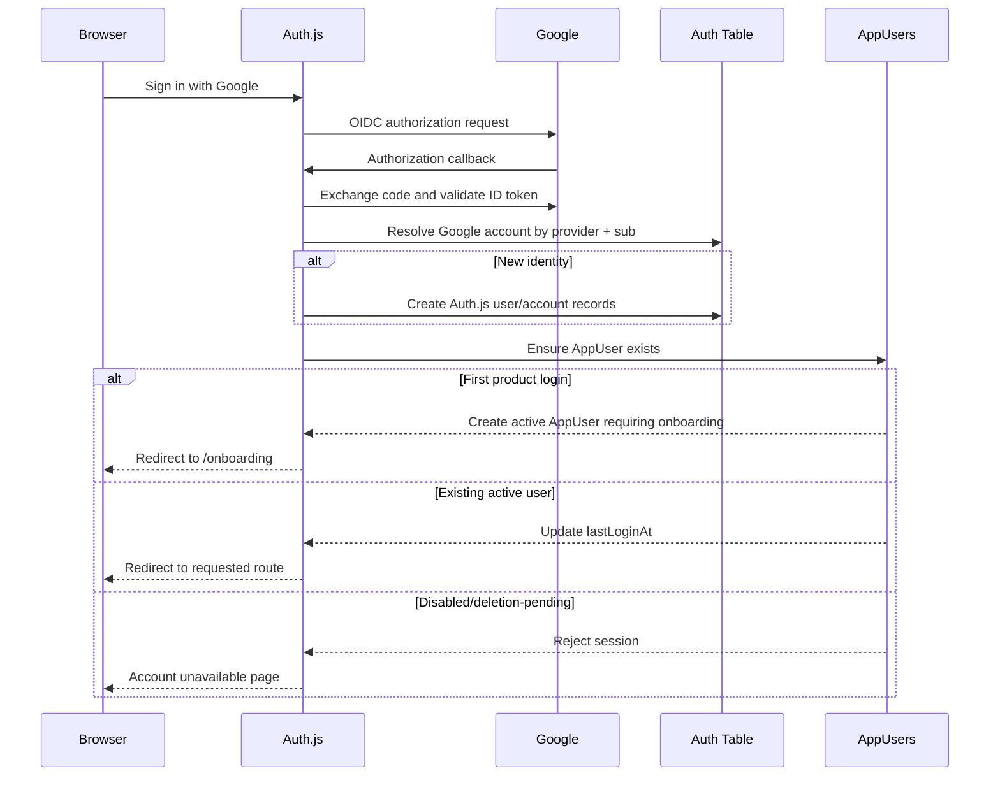

# Google Sign-In And User System Design

Status: Proposed design for later implementation  
Audience: Inkydoop product, engineering, security, privacy, and operations  
Last updated: 2026-09-02

This document defines a future adult account system for Inkydoop. It is intentionally separate from the implemented application documented in [README.md](README.md) and the broader product work in [roadmap.md](roadmap.md).

No part of this document is implemented unless the current source code says otherwise.

## 1. Decision Summary

Inkydoop will use:

- Google OpenID Connect through Auth.js for adult sign-in.
- Auth.js database sessions stored in Azure Table Storage.
- The official Auth.js Azure Tables adapter, supplied with an Azure `TableClient`.
- `DefaultAzureCredential` in production and an Azurite connection string locally.
- A separate Inkydoop `AppUsers` table for roles, account status, onboarding, consent versions, and product settings.
- Separate product tables for reader profiles, progress, favorites, entitlements, and audit events.
- Google subject (`sub`) as the provider identity key through Auth.js account records. Email is never an identity key.
- Adult roles only: `parent`, `teacher`, and `admin`.
- Anonymous reading as the default experience.
- Adult-managed reader profiles instead of child Google accounts.
- Server-side authorization checks close to every protected data operation.
- The existing generation key retained only for automation and emergency access during migration.

The first account release will not include subscriptions, classroom rostering, public profiles, social features, or direct child authentication.

## 2. Goals

### 2.1 Product Goals

- Let adults sign in with an existing Google account.
- Synchronize favorites and reading progress across devices.
- Let a parent manage a small set of private reader profiles.
- Let a teacher save and organize approved story packs.
- Replace the shared admin-key browser workflow with role-based admin access.
- Record the identity responsible for generation and moderation decisions.
- Support account export, deletion, disabling, and session revocation.
- Keep the public reading experience usable without signing in.

### 2.2 Engineering Goals

- Reuse the existing Next.js, TypeScript, Zod, Azure Table, and Managed Identity stack.
- Keep authentication records separate from product records.
- Avoid storing Google access and refresh tokens when no Google API access is needed.
- Use point reads and user/profile partitions rather than global scans.
- Make create/update operations idempotent.
- Support separate local, test, and production OAuth applications.
- Preserve a migration path from the current shared-key admin workflow.

### 2.3 Privacy Goals

- Collect the minimum information needed for an adult account.
- Do not require a child name, birthday, email, school, grade, location, gender, or photo.
- Do not persist free-text child answers by default.
- Do not expose reader profiles in public URLs.
- Do not use account or reader activity for behavioral advertising.
- Provide adult-controlled export and deletion.
- Define retention before collecting account-linked reading activity.

## 3. Non-Goals

The initial implementation will not provide:

- Google sign-in for children.
- Verification that a Google user is a parent, guardian, or teacher.
- Google Classroom integration.
- Google Drive, Calendar, Contacts, or Gmail access.
- Offline Google API access or refresh-token storage.
- School district single sign-on.
- Classroom rostering or student accounts.
- Public profiles, comments, followers, likes, or social feeds.
- Cross-household sharing of child progress.
- Personalized AI recommendations.
- Payments, subscriptions, or entitlements in the first account milestone.
- Permanent storage of comprehension answer text.

## 4. Core Trust Boundary

Google authentication proves control of a Google account. It does not prove:

- That the person is an adult.
- That the person is a parent or legal guardian.
- That the person is a verified teacher.
- That the person belongs to a particular school unless domain claims are explicitly verified.

Inkydoop will treat `parent` and `teacher` as self-declared product roles during initial onboarding. The UI and policy must not call those roles verified credentials.

Admin access is different: an administrator must be assigned server-side by an existing administrator or deployment operator. A client request can never promote a user to `admin`.

## 5. High-Level Architecture



## 6. Technology Choice

### 6.1 Authentication Library

Use the current Auth.js Next.js integration:

```ts
import NextAuth from "next-auth";
import Google from "next-auth/providers/google";

export const { handlers, auth, signIn, signOut } = NextAuth({
  providers: [Google],
});
```

The exact API must be verified against the installed Auth.js version when implementation begins.

### 6.2 OAuth Flow

Use Google OpenID Connect Authorization Code flow through Auth.js.

Required security behavior:

- HTTPS outside local development.
- Exact registered callback URL.
- Anti-forgery `state` validation.
- OpenID Connect `nonce` validation.
- Authorization code exchange on the server.
- ID-token signature validation.
- Issuer validation against Google's accepted issuers.
- Audience validation against the configured client ID.
- Expiration validation.
- Minimal scopes: `openid email profile`.
- No additional Google API scopes.

Google's stable `sub` claim is the external identity key. Email is mutable and must not be used as an account key.

### 6.3 Session Strategy

Use Auth.js database sessions, not JWT sessions.

Reasons:

- Disabled users can be blocked immediately.
- Individual sessions can be revoked.
- `Sign out everywhere` can delete all sessions for a user.
- Admin account compromise can be contained without waiting for a JWT to expire.
- Concurrent-session policy can be added later.
- Product roles and account status remain server-side.

Tradeoff:

- Protected requests require an Azure Table lookup.
- Session access must be measured and optimized.
- The adapter's behavior and partitioning must be load-tested before large-scale rollout.

### 6.4 Auth Storage

Install:

```text
next-auth
@auth/azure-tables-adapter
```

Auth.js owns one dedicated `Auth` table containing its user, provider account, session, and verification records according to the adapter contract.

The adapter receives an Azure `TableClient`:

- Local: `AZURE_STORAGE_CONNECTION_STRING=UseDevelopmentStorage=true`.
- Production: `AZURE_STORAGE_ACCOUNT` plus `DefaultAzureCredential`.

Do not introduce a production storage access key solely because the Auth.js documentation example uses `AzureNamedKeyCredential`. The adapter accepts a configured `TableClient`; use the repository's existing Managed Identity convention where supported and verify it in a deployment test.

### 6.5 Product Storage

Auth.js storage is not the Inkydoop user domain model. Product records live in separate tables and use the Auth.js user ID as `userId`.

This separation prevents authentication-library schema changes from controlling roles, consent, reader profiles, progress, and billing data.

## 7. Identity And Account Model

### 7.1 Auth.js-Owned Records

Auth.js owns:

- OAuth user record.
- Google account link.
- Database session.
- Verification records if a future provider needs them.

The Google account record must contain provider `google` and Google's provider account ID (`sub`).

Do not copy Google tokens into product tables.

### 7.2 AppUser

```ts
type UserRole = "parent" | "teacher" | "admin";
type UserStatus = "active" | "disabled" | "deletion_pending";

interface AppUser {
  userId: string;
  role: UserRole;
  status: UserStatus;

  displayName?: string;
  email?: string;
  emailVerified: boolean;
  avatarUrl?: string;

  onboardingCompleted: boolean;
  defaultProfileId?: string;

  termsVersion: string;
  privacyVersion: string;
  acceptedAt: string;

  createdAt: string;
  updatedAt: string;
  lastLoginAt: string;
  disabledAt?: string;
  deletionRequestedAt?: string;
}
```

Rules:

- `userId` is generated and owned by Auth.js.
- Email is informational and can change.
- Display name and avatar are optional.
- Role defaults to the onboarding choice `parent` or `teacher`.
- Role can become `admin` only through a privileged server-side operation.
- Disabled and deletion-pending users cannot create sessions or access protected data.
- Terms/privacy acceptance is versioned.

### 7.3 ReaderProfile

```ts
interface ReaderProfile {
  profileId: string;
  ownerUserId: string;
  label: string;
  tier: "early" | "growing" | "middle";
  status: "active" | "archived";
  createdAt: string;
  updatedAt: string;
}
```

Rules:

- `label` is optional in the UI and defaults to `Reader 1`, `Reader 2`, and so on.
- UI copy discourages full legal names.
- Maximum initial profile count: five per adult account.
- Profiles are private and visible only to their owner.
- Profile deletion cascades to progress and favorites through an explicit application operation.
- No child email, birthday, school, grade, address, gender, or image is collected.

### 7.4 ReadingProgress

```ts
interface ReadingProgress {
  profileId: string;
  packId: string;
  paragraphIndex: number;
  storyCompleted: boolean;
  vocabularyCompleted: boolean;
  comprehensionOpened: boolean;
  firstOpenedAt: string;
  lastOpenedAt: string;
  completedAt?: string;
  updatedAt: string;
}
```

Rules:

- One row per profile and pack.
- Upserts are idempotent.
- Paragraph index is clamped to the public story's bounds.
- Progress cannot be written for pending, rejected, or unknown packs.
- Free-text responses are not stored.
- Comprehension completion is not inferred from answer correctness in the first version.

### 7.5 Favorite

```ts
interface Favorite {
  profileId: string;
  packId: string;
  savedAt: string;
}
```

Rules:

- One row per profile and pack.
- Pack must be approved at write time.
- Missing or unpublished packs are omitted from reads.
- Maximum initial favorites: 500 per profile.

### 7.6 UserConsentEvent

Acceptance fields on `AppUser` show current state. Append-only events provide audit history.

```ts
interface UserConsentEvent {
  userId: string;
  eventId: string;
  type: "terms_accepted" | "privacy_accepted" | "adult_attested";
  documentVersion: string;
  occurredAt: string;
}
```

### 7.7 UserAuditEvent

```ts
interface UserAuditEvent {
  actorUserId: string;
  eventId: string;
  action:
    | "account_created"
    | "role_changed"
    | "account_disabled"
    | "account_enabled"
    | "deletion_requested"
    | "export_requested"
    | "story_generated"
    | "story_approved"
    | "story_rejected";
  targetType: "user" | "profile" | "pack";
  targetId: string;
  occurredAt: string;
  metadata?: Record<string, string | number | boolean>;
}
```

Never put access tokens, session tokens, story answer text, or secrets in audit metadata.

### 7.8 Entitlement: Deferred Schema

Billing is not part of the first account milestone, but keep the boundary explicit:

```ts
interface Entitlement {
  userId: string;
  plan: "free" | "family" | "teacher";
  status: "active" | "past_due" | "canceled";
  source: "manual" | "billing_provider" | "promotion";
  validUntil?: string;
  updatedAt: string;
}
```

Authentication determines identity. Entitlements determine product access. Do not mix them.

## 8. Azure Table Design

Use separate tables from `DailyPacks`.

| Table               | PartitionKey         | RowKey                  | Primary access pattern                       |
| ------------------- | -------------------- | ----------------------- | -------------------------------------------- |
| `Auth`              | Adapter-defined      | Adapter-defined         | Auth.js user/account/session operations      |
| `AppUsers`          | `user`               | `userId`                | Point-read product user by session user ID   |
| `ReaderProfiles`    | `ownerUserId`        | `profileId`             | List and point-read an adult's profiles      |
| `ReadingProgress`   | `profileId`          | `packId`                | Read/update one story; list profile history  |
| `Favorites`         | `profileId`          | `packId`                | Read/update one favorite; list saved stories |
| `UserConsentEvents` | `userId`             | time-sortable `eventId` | Consent history for one adult                |
| `UserAudit`         | actor or time bucket | time-sortable `eventId` | Admin/user audit queries                     |
| `Entitlements`      | `user`               | `userId`                | Deferred point-read entitlement              |

### 8.1 Key Rules

- Use opaque random IDs, for example UUIDv7 where a tested library is introduced.
- Never use email as `PartitionKey` or `RowKey`.
- Never use raw Google `sub` in logs or product-table URLs.
- Keep all profile-owned rows partitioned by `profileId`.
- Keep all user-owned profile rows partitioned by `ownerUserId`.
- Avoid the `daily` global-partition pattern used by content packs for user data.
- Use point reads for authorization-sensitive entities.

### 8.2 Product Store Modules

Proposed structure:

```text
src/lib/account/
  schemas.ts
  user-store.ts
  profile-store.ts
  progress-store.ts
  favorite-store.ts
  consent-store.ts
  audit-store.ts
  authorization.ts
```

Each store:

- Uses Zod at read/write boundaries.
- Uses the existing connection-string/Managed Identity pattern.
- Creates its local table if absent.
- Does not swallow authorization or schema failures.
- Exposes intent-based functions rather than raw `TableClient` access to routes.

### 8.3 Concurrency

Use Azure Table entity tags for conflicting updates where meaningful.

- Profile edits: optimistic concurrency with ETag.
- Progress updates: merge only monotonic fields where possible.
- Role/status changes: replace or conditional merge with ETag.
- Favorites: create/delete idempotently.
- Consent/audit events: create-only append.

## 9. Sign-In And Provisioning Flow



### 9.1 Idempotent AppUser Creation

OAuth callbacks can race across tabs or retries.

1. Read `AppUsers/user/<authUserId>`.
2. If present, update `lastLoginAt`.
3. If absent, attempt create-only insertion.
4. If insertion conflicts, read the existing row.
5. Never create two product users for one Auth.js user.

### 9.2 Requested Scopes

Use only:

```text
openid email profile
```

Do not request `offline` access or force `prompt=consent`. Inkydoop does not need Google API calls, so access and refresh tokens should not be retained beyond what Auth.js strictly requires for the login exchange.

### 9.3 Google Claims

Use:

- `sub`: provider identity through Auth.js account mapping.
- `email`: optional communication/display field.
- `email_verified`: informational account assurance.
- `name`: optional display-name seed.
- `picture`: optional adult avatar.

Do not use:

- Email as unique identity.
- Email domain as an authorization decision unless an explicit verified-domain feature is designed.
- Google profile fields to infer age or parental status.

## 10. Session Design

### 10.1 Cookie

Auth.js database session cookie must be:

- HTTP-only.
- Secure in test/production.
- SameSite Lax unless a verified Auth.js flow requires otherwise.
- Host-only where possible.
- Bounded lifetime.

Initial policy:

- Maximum session age: 30 days.
- Refresh/update age: verify Auth.js defaults and choose a bounded value.
- Delete session on sign-out.
- Delete all sessions on disable, account deletion, or explicit sign-out-everywhere.

### 10.2 Session Payload

Expose only:

```ts
interface InkydoopSessionUser {
  id: string;
  role: "parent" | "teacher" | "admin";
  status: "active";
  onboardingCompleted: boolean;
}
```

Do not put reader profiles, favorites, progress, Google tokens, or consent history in the session payload.

### 10.3 Status Revalidation

Every protected operation must verify:

1. Auth.js session exists.
2. Session user ID maps to an `AppUser`.
3. User status is `active`.
4. Required role is present.
5. Requested profile belongs to the user.

Do not rely on a layout, navigation state, or `proxy.ts` alone. Authorization is enforced next to the data operation.

## 11. Authorization Model

### 11.1 Role Matrix

| Capability                         | Anonymous | Parent |  Teacher |                      Admin |
| ---------------------------------- | --------: | -----: | -------: | -------------------------: |
| Read approved stories              |       Yes |    Yes |      Yes |                        Yes |
| Use local tier/theme               |       Yes |    Yes |      Yes |                        Yes |
| Manage own reader profiles         |        No |    Yes | Optional |                        Yes |
| Synchronize own progress/favorites |        No |    Yes |      Yes |                        Yes |
| Save teacher collections           |        No |     No |      Yes |                        Yes |
| Generate stories                   |        No |     No |       No |                        Yes |
| Review pending stories             |        No |     No |       No |                        Yes |
| Approve/reject stories             |        No |     No |       No |                        Yes |
| Assign admin role                  |        No |     No |       No | Restricted admin operation |
| Disable other accounts             |        No |     No |       No | Restricted admin operation |

### 11.2 Authorization Helpers

```ts
requireSession(): Promise<ActiveUserContext>
requireRole(role: UserRole): Promise<ActiveUserContext>
requireOwnedProfile(profileId: string): Promise<ReaderProfile>
requireAdminOrAutomation(request: Request): Promise<AdminActor>
```

`AdminActor` distinguishes:

```ts
type AdminActor =
  { kind: "user"; userId: string } | { kind: "automation"; keyId: string };
```

This allows audit records to distinguish browser admins from automation.

### 11.3 Role Assignment

Initial admin bootstrap:

- Deployment configuration contains a one-time list of approved Google subjects or emails only for bootstrap.
- On first matching sign-in, a server-side bootstrap operation assigns `admin`.
- After the first admin exists, remove or disable bootstrap configuration.
- Long-term admin assignment is an audited server-side action by another admin.

Prefer Google `sub` for bootstrap when available. Email-based bootstrap is temporary and must require `email_verified`.

## 12. Route Design

### 12.1 Auth.js Routes

```text
/api/auth/[...nextauth]
```

Google callback:

```text
/api/auth/callback/google
```

Register exact callback URLs separately:

```text
http://localhost:3000/api/auth/callback/google
https://test.example.com/api/auth/callback/google
https://www.example.com/api/auth/callback/google
```

Use separate Google OAuth clients for local/test and production where operationally practical.

### 12.2 Product Pages

```text
/sign-in
/onboarding
/account
/account/profiles
/account/privacy
/account/export
/account/delete
```

Future teacher pages:

```text
/teacher
/teacher/saved
/teacher/collections
```

### 12.3 Product APIs

```text
GET    /api/account
PATCH  /api/account
POST   /api/account/export
POST   /api/account/delete

GET    /api/profiles
POST   /api/profiles
PATCH  /api/profiles/[profileId]
DELETE /api/profiles/[profileId]

GET    /api/profiles/[profileId]/progress
PUT    /api/profiles/[profileId]/progress/[packId]

GET    /api/profiles/[profileId]/favorites
PUT    /api/profiles/[profileId]/favorites/[packId]
DELETE /api/profiles/[profileId]/favorites/[packId]
```

All request/response bodies use shared Zod schemas.

### 12.4 Admin Routes

Current routes:

```text
/admin
/api/admin/moderation
/api/admin/moderation/image
/api/generate
```

Migration target:

- Browser requests require an active `admin` session.
- Generation and moderation audit records include `actorUserId`.
- `x-generate-key` remains accepted only for explicit automation paths.
- Automation endpoints must not depend on browser cookies.
- Eventually use a separate automation credential rather than overloading `GENERATE_API_KEY`.

## 13. Onboarding

First-login onboarding is required before product account features are available.

### 13.1 Steps

1. Confirm this is an adult account.
2. Choose Parent or Teacher.
3. Review and accept current Terms and Privacy Policy.
4. Optionally create a reader profile.
5. Choose the profile's reading tier.
6. Offer explicit import of device-local favorites/progress when those features exist.

### 13.2 Rules

- Never offer `admin` as an onboarding role.
- Do not claim identity or professional verification.
- Parent onboarding can be skipped if the adult only wants favorites for themselves.
- Teacher onboarding must not imply school approval.
- Store consent versions and append consent events.
- If required legal text changes, require re-acceptance before protected features continue.

## 14. Anonymous-To-Account Migration

Anonymous reading remains first-class.

### 14.1 Local Data Eligible For Import

- Selected tier.
- Favorite pack IDs.
- Last-read pack and paragraph.
- Completion flags.

### 14.2 Import Flow

1. Sign in and complete onboarding.
2. Detect supported local data.
3. Show exactly what will be imported.
4. Let the adult choose a destination reader profile.
5. Require explicit confirmation.
6. Validate every pack is approved.
7. Upsert progress/favorites idempotently.
8. Mark local data imported or leave it in place according to the user's choice.

Do not silently attach pre-sign-in device activity to an account.

## 15. Features Enabled By Accounts

### 15.1 Immediate Features

- Cross-device favorites.
- Cross-device Continue Reading.
- Multiple private reader profiles.
- Per-profile reading tier.
- Reading history.
- Account export and deletion.
- Role-based admin access.
- Moderator identity and audit trail.

### 15.2 Parent Features

- Household reader profiles.
- Weekly private activity summary.
- Stories completed.
- Vocabulary activities completed.
- Saved stories.
- Optional adult-selected reading goals.
- Profile-level tier controls.

Avoid:

- Numeric reading-ability scores without educational validation.
- Public or sibling comparison.
- Punitive streak mechanics.
- Storing child free-text answers by default.

### 15.3 Teacher Features

- Saved classroom packs.
- Private story collections.
- Filters by tier, genre, theme, and reading time.
- Print history.
- Shareable approved reading lists.
- Future anonymous classroom codes.
- Future school licensing entitlements.

### 15.4 Admin Features

- Session-protected generation and moderation.
- Reviewer identity on decisions.
- Generation identity and history.
- Role management.
- Account disable/enable.
- Audit logs.
- Separate generator, moderator, and administrator permissions if one `admin` role becomes too broad.

### 15.5 Commercial Features

Deferred but enabled by stable adult identity:

- Family plans.
- Teacher plans.
- School licenses.
- Promotional entitlements.
- Billing support history.
- Plan-level limits.

## 16. Moderation Integration

Current moderation stores status, timestamp, and note but no reviewer identity.

Target moderation entity fields:

```ts
interface ModerationRecord {
  moderationStatus: "pending" | "approved" | "rejected";
  moderatedAt?: string;
  moderationNote?: string;
  moderatedByUserId?: string;
  moderationActorType?: "user" | "automation";
}
```

Rules:

- Human browser decisions require `admin` session.
- `moderatedByUserId` is written server-side from the session.
- Client-supplied reviewer IDs are ignored/rejected.
- Automation decisions, if ever allowed, use an explicit actor type and key ID.
- Public APIs never expose reviewer ID or internal notes.
- Audit event is append-only even if moderation status changes later.

## 17. Account Lifecycle

### 17.1 Active

- Can sign in.
- Can access owned data.
- Can create/update profiles within limits.

### 17.2 Disabled

- New sign-in is rejected.
- Existing sessions are deleted.
- Product data is retained.
- Admin action and reason are audited.

### 17.3 Deletion Pending

- New sessions are rejected.
- Existing sessions are deleted.
- Export can be offered before final deletion.
- A short recovery window may be used only if documented.

### 17.4 Deletion Execution

Delete in this order:

1. Auth.js sessions.
2. Favorites.
3. Reading progress.
4. Reader profiles.
5. Teacher collections and product-owned records.
6. Product `AppUser` record.
7. Auth.js account/user records according to adapter capabilities.

Retain only legally required or security audit information, with IDs anonymized where possible and retention documented.

### 17.5 Export

Export contains:

- Account profile and role.
- Consent history.
- Reader profiles.
- Favorites.
- Reading progress/history.
- Teacher collections.

Export excludes:

- Session tokens.
- OAuth tokens.
- Internal security telemetry.
- Other users' data.

## 18. Error And Recovery Design

### 18.1 OAuth Errors

Handle:

- User cancels Google consent.
- State/nonce validation failure.
- Redirect URI mismatch.
- Google outage or token exchange failure.
- Missing/invalid subject.
- Unverified email where policy requires verification.
- Disabled product account.

Show a generic user-facing error and log a sanitized category. Never log authorization codes, ID tokens, access tokens, refresh tokens, client secrets, or full provider payloads.

### 18.2 Product Provisioning Failure

If Auth.js creates its user/account but `AppUser` creation fails:

- Do not grant product access.
- Retry idempotently on next request/sign-in.
- Record a sanitized operational error.
- Provide an account-setup retry page.

### 18.3 Session Store Failure

- Protected account/admin operations fail closed.
- Public reading remains available.
- Do not silently downgrade an admin operation to shared-key behavior.
- Surface health/operations alerts.

### 18.4 Profile Data Failure

- Do not corrupt local progress.
- Return structured errors.
- Allow retry.
- Never write data under a profile not owned by the current user.

## 19. Security Requirements

### 19.1 Secrets

Future environment variables:

```text
AUTH_SECRET
AUTH_GOOGLE_ID
AUTH_GOOGLE_SECRET
AZURE_AUTH_TABLE_NAME=Auth
AZURE_USERS_TABLE_NAME=AppUsers
AZURE_PROFILES_TABLE_NAME=ReaderProfiles
AZURE_PROGRESS_TABLE_NAME=ReadingProgress
AZURE_FAVORITES_TABLE_NAME=Favorites
AZURE_CONSENT_TABLE_NAME=UserConsentEvents
AZURE_USER_AUDIT_TABLE_NAME=UserAudit
```

Requirements:

- `AUTH_SECRET` is high entropy.
- Google client secret is stored in ACA secrets or Key Vault.
- Secrets are different across test and production.
- Secrets never use `NEXT_PUBLIC_`.
- Secrets are never logged or returned.
- Rotation procedure is documented and tested.

### 19.2 OAuth And Session Security

- Auth.js handles state, nonce, callback, and token validation.
- Verify configured version and defaults during implementation.
- Use HTTPS in test/production.
- Restrict callback URLs exactly.
- Use secure HTTP-only cookies.
- Protect state-changing routes from CSRF.
- Validate every redirect target against same-origin allowlists.
- Do not expose provider tokens to the browser.
- Do not store refresh tokens without a specific Google API requirement.

### 19.3 Authorization Security

- Validate session next to data access.
- Check user status on every protected operation.
- Check profile ownership on every profile operation.
- Assign roles server-side.
- Reject unknown roles/status values.
- Rate-limit auth and account mutation endpoints.
- Audit role, status, generation, moderation, export, and deletion actions.

### 19.4 Data Security

- Use Managed Identity and least-privilege Storage Table Data roles in production.
- Separate test and production storage accounts.
- Disable shared-key storage access where compatible with all dependencies.
- Use private endpoints only if operational requirements justify them.
- Never put personal data in public Blob metadata or story pack rows.
- Avoid storing IP addresses in product analytics or user audit payloads.

## 20. Privacy And Compliance Work

Before collecting reader-profile activity:

- Obtain specialist child-privacy/legal review for launch regions.
- Determine whether and how COPPA, GDPR-K, UK Age Appropriate Design Code, state laws, and school privacy rules apply.
- Define who is the data controller and processor.
- Publish Terms and Privacy Policy.
- Define data retention by entity.
- Implement export and deletion.
- Document subprocessors, including Google, Microsoft Azure, and AI providers.
- Review whether adult attestation is sufficient for the intended features.
- Do not introduce behavioral advertising.
- Do not send account-linked reader activity to AI providers unless strictly required and disclosed.
- Do not store free-text child responses by default.

This document is an engineering design, not legal advice.

## 21. Observability And Audit

Track aggregate operational metrics:

- Sign-in attempts, successes, and sanitized failure categories.
- New AppUser provisioning success/failure.
- Active database sessions.
- Session lookup latency and failure rate.
- Account disable/delete/export operations.
- Profile/progress/favorite operation failures.
- Admin authorization failures.
- Moderation decisions by actor ID.

Do not log:

- OAuth codes or tokens.
- Session tokens.
- Google `sub` in plaintext operational logs.
- Full email addresses unless an approved support workflow requires it.
- Reader profile labels.
- Child activity details.
- Free-text answers.

Use correlation IDs that are not user identifiers.

## 22. Performance And Scale

Initial assumptions:

- Public reads remain anonymous and do not perform session lookups unless account UI is needed.
- Protected requests perform a session lookup and one product-user point read.
- Progress writes are throttled and idempotent.
- Favorites use point create/delete operations.
- Profile/history lists stay within one partition.

Before high-scale launch:

- Load-test Auth.js Azure Tables adapter access patterns.
- Measure session lookup latency from the hosting region.
- Confirm adapter entity partitioning avoids a hot global partition.
- Define cache rules that do not allow disabled users to retain access.
- Estimate Table transactions for daily and monthly active-user targets.
- Verify session cleanup and expired-record behavior.

## 23. UI Design

### 23.1 Anonymous Header

- Keep current reader controls.
- Add a quiet `Sign in` command intended for adults.
- Do not block stories behind authentication.

### 23.2 Signed-In Header

- Show compact adult avatar/menu.
- Keep tier control associated with active reader profile where one exists.
- Menu: Account, Profiles, Teacher area when applicable, Admin when applicable, Sign out.

### 23.3 Account Page

Show:

- Adult display name and email.
- Role and account status.
- Reader profiles.
- Privacy/terms versions.
- Export and deletion actions.
- Sign out everywhere.

### 23.4 Profile Switcher

- Show profile labels and tiers.
- Avoid child photos.
- Make the active profile clear.
- Support anonymous/no-profile reading.

### 23.5 Admin Migration

- Google admin session replaces key entry in the browser.
- Do not display or ask for `GENERATE_API_KEY` after migration.
- Keep an explicit automation path outside browser forms.
- Display actor identity in private moderation audit views.

## 24. Testing Strategy

### 24.1 Unit Tests

- Product user/profile/progress/favorite Zod schemas.
- Role and status authorization.
- Profile ownership.
- Idempotent AppUser creation.
- Disabled/deletion-pending checks.
- Progress clamping and monotonic updates.
- Local-data import validation.
- Moderation actor assignment.

### 24.2 Adapter Integration Tests

Using Azurite:

- Create OAuth user/account records through adapter methods.
- Create/read/delete database sessions.
- Expire and revoke sessions.
- Concurrent first-login product provisioning.
- Sign out everywhere.
- Account deletion cleanup.
- Managed Identity test in Azure test environment.

### 24.3 Auth Flow Tests

Do not automate against real Google credentials in ordinary CI.

- Unit-test callbacks with signed fixtures/mocks.
- Browser-test signed-out and signed-in application states with a test auth provider or mocked session boundary.
- Run a small manual test plan against a dedicated Google test OAuth client.

Manual cases:

- First login.
- Returning login.
- Consent cancellation.
- Wrong callback URL.
- Disabled user.
- Session expiration.
- Sign out.
- Sign out everywhere.
- Account deletion.

### 24.4 Authorization Tests

For every protected API:

- Anonymous returns `401`.
- Wrong role returns `403`.
- Disabled user returns `403` or account-disabled response.
- Owner succeeds.
- Another user's profile returns `404` or `403` according to a consistent non-enumeration policy.
- Invalid body returns `400`.
- CSRF/incorrect method is rejected.

### 24.5 Privacy Tests

- No answer text in account storage.
- No personal data in story pack or Blob paths.
- Export contains only the requesting user's data.
- Deletion removes all owned entities.
- Logs contain no OAuth/session tokens.
- Analytics payload rejects prohibited fields.

## 25. Rollout And Migration

### Phase A: Foundations

- Complete privacy and security review.
- Create Google Cloud OAuth clients for local/test/production.
- Add Auth.js and Azure Tables adapter.
- Add auth environment validation.
- Implement database sessions.
- Implement `AppUsers` and idempotent provisioning.
- Add account status checks.

Exit criteria:

- Adult can sign in/out in test.
- Product user is created exactly once.
- Disabled account cannot sign in or retain sessions.
- Public reading remains unaffected.

### Phase B: Onboarding And Account Lifecycle

- Adult attestation.
- Parent/teacher role choice.
- Terms/privacy acceptance.
- Account page.
- Export, delete, and sign-out-everywhere.

Exit criteria:

- Every active account has current consent state.
- Export/deletion tests pass.
- No admin role is client-selectable.

### Phase C: Reader Profiles And Synchronization

- Reader profiles.
- Favorites.
- Reading progress.
- Profile switcher.
- Explicit local-state import.

Exit criteria:

- Cross-device synchronization works.
- Ownership tests pass.
- No prohibited child fields are collected.

### Phase D: Admin Identity Migration

- Require admin sessions for browser admin routes.
- Record generation/moderation actor.
- Add role-management operation.
- Separate automation key path.
- Remove generate-key input from `/admin`.

Exit criteria:

- Shared key is no longer used in browser admin workflows.
- Every human moderation decision has an actor ID.
- Automation remains auditable and isolated.

### Phase E: Teacher And Commercial Features

- Teacher collections and saved packs.
- Entitlements.
- Billing only after a separate approved design.

## 26. Feature Flags And Backout

Use server-side flags for staged rollout:

```text
AUTH_ENABLED
ACCOUNT_ONBOARDING_ENABLED
SYNCED_PROGRESS_ENABLED
ADMIN_SESSION_AUTH_ENABLED
```

Rules:

- Flags default off outside explicitly configured environments.
- Turning off account UI must not make stored account data public.
- Disabling admin session auth must not silently open admin routes; emergency key behavior must be explicit.
- Public anonymous reading remains available during auth outages.
- Database schema is additive so rollback does not require destructive migrations.

## 27. Open Decisions Before Implementation

These must be resolved before coding begins:

1. Confirm Auth.js version and whether the Azure Tables adapter fully supports `DefaultAzureCredential` with the provided `TableClient`.
2. Confirm adapter partition/access behavior under expected user/session volume.
3. Decide exact session lifetime and update-age values.
4. Decide whether teacher accounts may create reader profiles in the first release.
5. Decide account deletion recovery window and legally required retention.
6. Decide initial administrator bootstrap procedure.
7. Decide non-enumeration response policy (`403` versus `404`) for unauthorized profile IDs.
8. Complete legal/privacy review for adult-managed reader progress.
9. Decide whether adult email is stored in `AppUsers` or read only from Auth.js records.
10. Decide test-auth strategy for CI browser tests.

## 28. Implementation Checklist

### Authentication

- [ ] Add Auth.js and Azure Tables adapter dependencies.
- [ ] Configure Google provider.
- [ ] Configure local/test/production callback URLs.
- [ ] Configure database sessions.
- [ ] Add validated auth environment variables.
- [ ] Add Auth.js route handlers.
- [ ] Add sign-in/sign-out controls.

### Product User

- [ ] Add `AppUser` Zod schema and store.
- [ ] Add idempotent first-login provisioning.
- [ ] Add onboarding state and routes.
- [ ] Add role/status authorization helpers.
- [ ] Add account page.
- [ ] Add consent events.
- [ ] Add export/delete/sign-out-everywhere.

### Reader Profiles

- [ ] Add profile schema and store.
- [ ] Add ownership checks.
- [ ] Add profile CRUD.
- [ ] Add active-profile selection.
- [ ] Add favorites and progress stores.
- [ ] Add explicit local-data import.

### Admin Migration

- [ ] Add admin role bootstrap.
- [ ] Protect `/admin` and admin APIs with session role checks.
- [ ] Record generation and moderation actor IDs.
- [ ] Separate browser admin auth from automation credentials.
- [ ] Remove shared-key entry from browser UI.

### Quality And Operations

- [ ] Add unit, integration, authorization, privacy, and browser tests.
- [ ] Add auth health/latency monitoring.
- [ ] Add account lifecycle runbooks.
- [ ] Add secret rotation runbook.
- [ ] Complete privacy/security/legal review.
- [ ] Update README and roadmap after implementation.

## 29. Acceptance Criteria

The initial adult account system is complete when:

- An adult can sign in with Google and sign out.
- Google `sub`, not email, identifies the provider account.
- Auth.js stores revocable database sessions in Azure Table Storage.
- One idempotent `AppUser` exists per Auth.js user.
- Parent/teacher onboarding records current policy acceptance.
- Admin role cannot be self-assigned.
- Disabled/deletion-pending accounts cannot use protected APIs.
- Anonymous reading continues without authentication.
- An adult can create private minimal reader profiles.
- Favorites and reading progress synchronize across devices.
- No child email, birthday, school, location, photo, or answer text is required or stored.
- Users can export and delete their data.
- Human moderation decisions record the authenticated admin actor.
- The browser admin workflow no longer asks for the shared generation key.
- Authorization, lifecycle, privacy, and browser tests pass.
- Production uses managed identity for Azure data access where supported.
- Test and production use separate OAuth clients, secrets, and storage.

## 30. Expected Outcomes

- Adults can retain and synchronize useful reading state without creating child accounts.
- Inkydoop gains a stable identity boundary for parent, teacher, admin, and future commercial features.
- Admin actions become attributable and revocable instead of relying on a shared browser-entered secret.
- Reader data remains private, minimal, partitioned by owner/profile, and removable.
- Authentication outages do not block the public reading experience.
- Future subscriptions, teacher collections, and school offerings can build on entitlements rather than coupling billing to Google identity.
